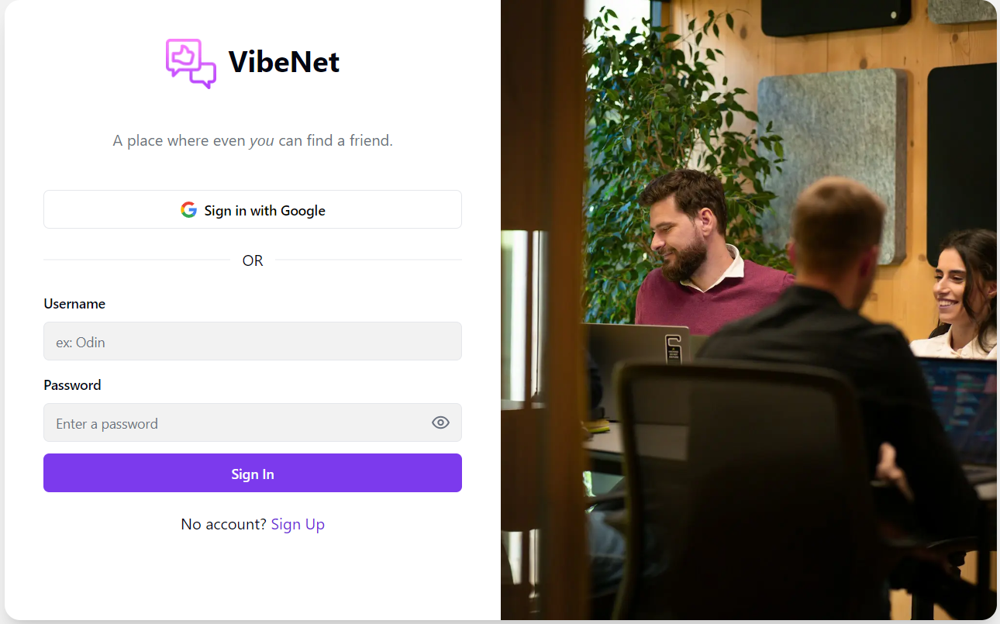
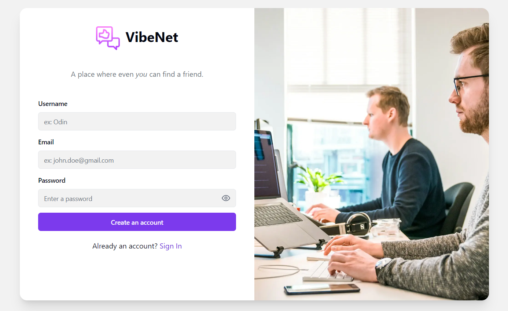
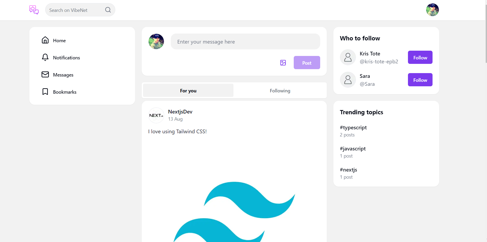
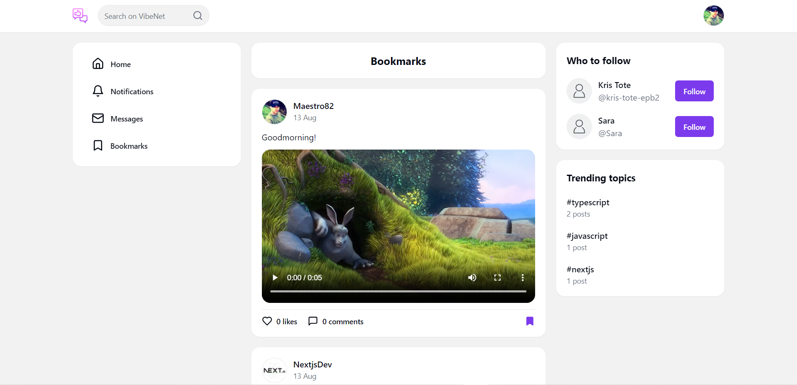
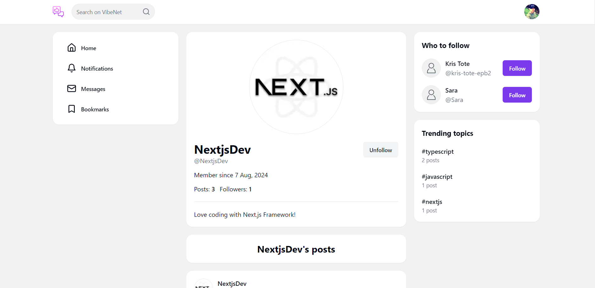

**IMPORTANT**: After cloning the repo, open the command line inside the project and run `npm i --legacy-peer-deps`. This is necessary because we are using Next.js v15 rc (release candidate).

# Features

🔐 Lucia Auth (with credentials and Google OAuth)
💾 PostgreSQL
🖌️ Tailwind CSS
👦 Create a new user / update user profile
📸 Post media uploads (image & video)
🤏 Drag & drop and copy-paste uploads
⏱ Cron job to delete orphaned uploads (Vercel cron)
💻 Post details page
👍 Likes feature (optimistic updates)
👁 Follow system
📒 Bookmarks feature
💬 Comments feature (with infinite loading)
🔔 Notifications feature (Prisma transactions)
👪 Direct messages feature (Stream Chat)
🔍 Search feature (+ rewrites)
... more
